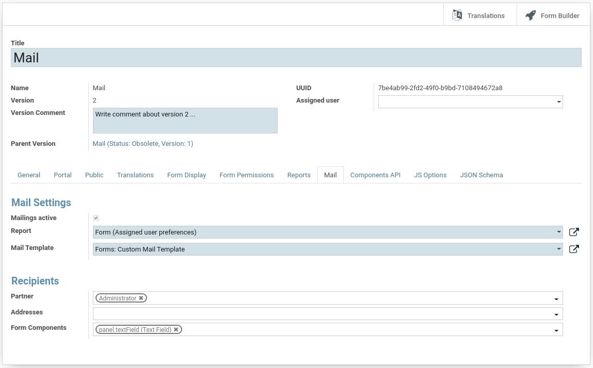

# Formio Mail Extension

This module aims to extend the Odoo form.io stack with features, such as:

* Send submitted forms as PDF to mail recipients
* Mail recipients can be specified in three ways:
    * Static mail address
    * Use partner mail address (contacts)
    * A user can specify the recipient in a form component
* Every form builder can have a mail.template
    
# Specify Recipients

There are the following three ways to specify a recipient:

# Specify Recipients

## Using Partner Entry

Select one or multiple partner entries in the field Partner.

The extension tries to access the partner.email field.
If the partner has a valid mail address the plugin will send the
form after submission, to specified partner's.
Also partner's language will be selected in template context.

## Using Fixed Addresses

Specify one or multiple (comma-separated) mail addresses in the field Addresses.

The extension computes entered mail addresses and if 
they're valid the plugin will send the form after submission, 
to specified recipients.

It's a great feature for fixed, group or shared mail addresses.

## Using Form Components

Select form components from the (many2many) field Form.

The extension computes the value of the specified form components
after submission and if the value of a components holds a valid
mail address it tries to send a PDF report.

## Supported Fields

The following form components are supported and working:

 - datagrid
 - email
 - select
 - selectboxes
 - textfield

# Authors and Contributors

- Nova Code
- Yannik Lieblinger
